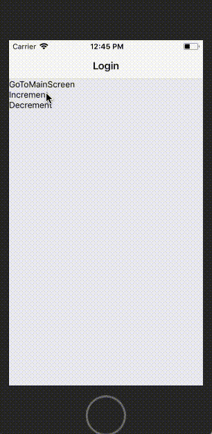

# reason-react-native-navigation
This is a simple react native navigation written in reason. It has been created with an eye to fully utilize Reason type-system. 
Currently, only stack-navigation (standard slide from left for iOS and slide from button from Android) is implemented.
Main problem that we are trying to solve with this is passing props to child components in a straightforward and type-safe way.

## How does it look like?
The example app is avaialble at https://github.com/szymonzmyslony/reason-react-native-navigation-exampleApp


This is how this example app looks like:


As you can see the count update (state of the root component) doesn't get rerendered when you click increment or decrement on the second screen. This is the first issue that I will be working on solving.


## How to use it (when you want to have a full control over your navigation state)?
StackNavigator is a functor that expects one type for your navigationState variant:
```reason
module type Impl = {
  type navigationState;
};
```

This is how you create a functor:

```reason
module StackNavigator =
  StackNavigator.Make {
    type navigationState = screen;
  };
```

For example, in my simple app, I had:
```reason
type screen =
  | Login
  | MainScreen
  | Player int string;

```
StackNavigator requires navigation state to be managed by parent component. Thus, we need to pass 
navigation state, pop, and push methods, and two render functions (header and screen). This is how root render in my app looks
like:
```reason
 render: fun {state, update, handle} =>
    ReasonReact.element @@
    StackNavigator.make
      navigationState::state.navigationState
      goBack::(update pop)
      getHeaderConfig::headerTitle
      render::(
        renderScreen
          ::handle
          pop::(update pop)
          push::(update push)
          updateProjects::(update updateProjects)
          projects::state.projects
      )
```      
renderScreen and render can take any arguments needed from the root of the app and pass it down to other screens:
```reason
let renderScreen
    pop::(pop: 'a => unit)
    push::(push: screen => unit)
    ::projects
    ::handle
    ::updateProjects
    screen =>
  switch screen {
  | Login => ReasonReact.element @@ LoginScreen.make ()
  | Player index _id => DetailViewProject.render project::(List.nth projects index)
  | MainScreen =>
    ReasonReact.element @@ MainScreenContainer.make ::push ::updateProjects ::projects
  };

let headerTitle screen =>
  switch screen {
  | MainScreen => "Shows"
  | _ => "test"
  };
  ```

  New StatefullStackNavigator module avoid boilerplate for push and pop actions. 
  The example app (https://github.com/szymonzmyslony/reason-react-native-navigation-exampleApp)
  is showing how to use it. 


